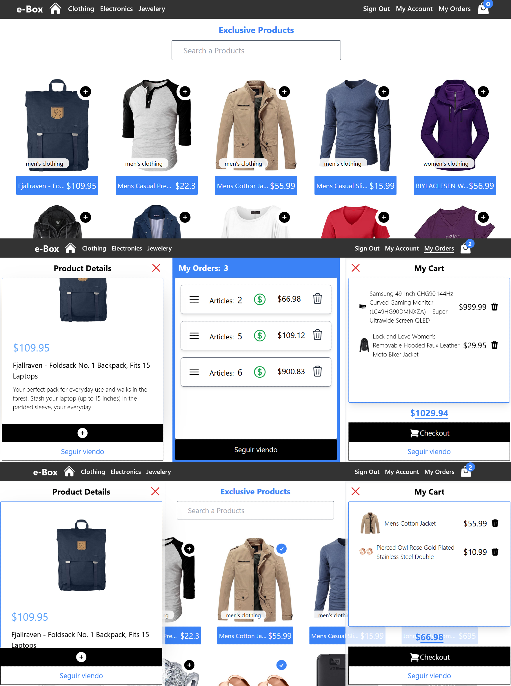

## E-Commerce "e-Box" 🛒
Echo con mucho entusiasmo por su autor , actualmente trabajando en su optimizacion aplicando buenas practicas, y ademas, en una mejor experiencia para el UI (User Interface)

## DESCRIPCION: 
Shopi es una plataforma de comercio electrónico que ofrece una amplia variedad de productos, desde ropa y electrónica hasta muebles y juguetes. Nuestro objetivo es proporcionar una experiencia de compra fácil, segura y conveniente para nuestros clientes.

## Tecnologías y Herramientas

### FRONTEND:
- React: como mi marco de desarrollo para crear una interfaz de usuario moderna y receptiva.
- React Router: para la navegación entre páginas.
- Tailwind CSS: para estilizar los componentes y lograr un diseño atractivo.
- Heroicons: para los íconos en la barra de navegación demas componentes.
- Context API: para administrar el estado global, como el carrito de compras.
- Responsive: Adaptibilidad según el dispositivo
- LocalStorage: Para ayudar mantener persistencia en los datos.
- CustomHook: en desarrollo

### BACKEND:

- **Tecnologías Utilizadas:** Express.js - Joi - Boom - Docker - pg - eslint y eslint-config-prettier - Faker - Cors - Dotenv

- **Express.js:** Framework de Node.js utilizado para construir el servidor y manejar las rutas.

- **Joi:** Librería para la validación de datos, garantizando que los datos de entrada cumplan con ciertos esquemas.

- **@hapi/boom:** Utilizado para el manejo de errores HTTP de manera consistente.

- **PostgreSQL:** Base de datos relacional utilizada para almacenar los datos del e-commerce.

- **Docker:** Herramienta de contenedorización utilizada para crear entornos aislados para PostgreSQL y pgAdmin.

- **pg:** Cliente de Node.js para conectarse y realizar consultas a PostgreSQL.

- **@faker-js/faker:** Utilizado para generar datos falsos para productos, útil para pruebas y desarrollo.

- **eslint y eslint-config-prettier:** Herramientas de linting y formateo de código para mantener la consistencia y calidad del código.

- **dotenv**:** Utilizado para manejar variables de entorno de manera segura y conveniente.

- **cors:** Middleware para habilitar CORS (Cross-Origin Resource Sharing), permitiendo que la API sea accesible desde diferentes dominios.

- **Git:** Utilizo Git para el control de versiones y alojo nuestro repositorio en GitHub.

